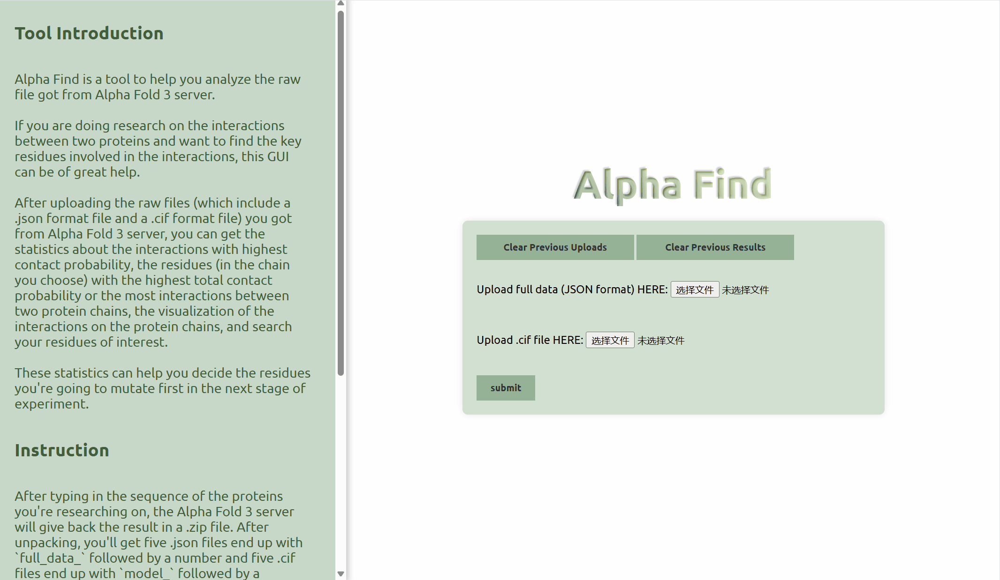
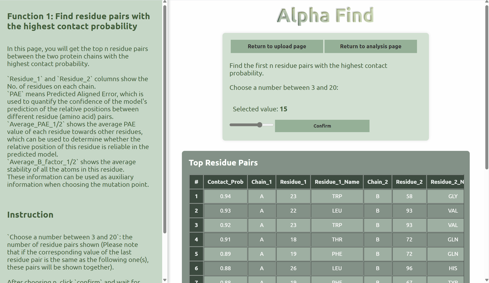
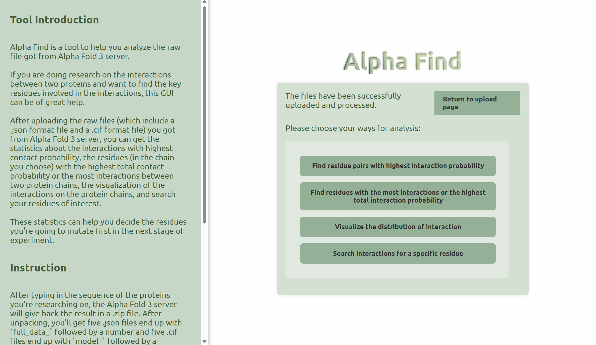

<div align="center">
    <p>
    <a href="https://github.com/Cannizzaro-reaction/AF3_GUI"></a>
    <a href="https://github.com/Cannizzaro-reaction/AF3_GUI?tab=MIT-1-ov-file"></a>
    </p>
    <p>
    <a href="https://github.com/Cannizzaro-reaction"><strong>Cannizzaro-reaction</strong></a>
    &nbsp;
    </p>
    <b>A tool to analyze the raw data from AlphaFold3 server and visualize the interactions between two protein chains, designed for our 44th prp project in SJTU</b>
    <p>


## Tool Introduction

Alpha Find is a tool to help you analyze the raw file got from Alpha Fold 3 server.

If you are doing research on the interactions between two proteins and want to find the key residues involved in the interactions, this GUI can be of great help.

After uploading the raw files (which include a `.json` format file and a `.cif` format file) you got from Alpha Fold 3 server, you can get the statistics about the interactions with highest contact probability, the residues (in the chain you choose) with the highest total contact probability or the most interactions between two protein chains, the visualization of the interactions on the protein chains, and search your residues of interest.

These statistics can help you decide the residues you're going to mutate first in the next stage of experiment.


**You can analyze your data following the instruction below.**

* **upload the raw files:**

  

  After typing in the sequence of the proteins you're researching on, the Alpha Fold 3 server will give back the result in a .zip file. After unpacking, you'll get five `.json` files end up with `full_data_` followed by a number and five `.cif` files end up with `model_` followed by a number. These are the results given by five different models.

  Choose one `.json` and one `.cif` for your analysis and make sure their ending numbers are the same. Upload the two files according to the hints in the green box.

  If you've used this tool before, REMEMBER to clear the previous upload and results BEFORE A NEW TRY.

  Once the files have been successfully submitted, you can choose a way to analyze from the four choice given in the box.

  `Return to upload page` if you want to change the files you've submitted.

  


* **Find residue pairs with the highest contact probability:**

  

  Choose the first button on the page. In this page, you will get the top n residue pairs between the two protein chains with the highest contact probability.

  `Residue_1` and `Residue_2` columns show the No. of residues on each chain.
  `PAE` means Predicted Aligned Error, which is used to quantify the confidence of the model's prediction of the relative positions between different residue (amino acid) pairs.
  `Average_PAE_1/2` shows the average PAE value of each residue towards other residues, which can be used to determine whether the relative position of this residue is reliable in the predicted model.
  `Average_B_factor_1/2` shows the average stability of all the atoms in this residue.
  These information can be used as auxiliary information when choosing the mutation point.

  

  There's one slider on the analysis page,`Choose a number between 3 and 20`. You can choose the number of residue pairs shown (Please note that if the corresponding value of the last residue pair is the same as the following one(s), these pairs will be shown together).

  After choosing n, click `confirm` and wait for the result in the table below.

  Both the result shown on the screen and the full statistics of all the interactions between the two chains can be saved in `.csv `format.

  


* **Find residues with the most interactions or the highest total interaction probability**:

  

  `Return to analysis page` and choose the second button. In this page, you will get the top n residues on your chosen chain who have the most interactions (which means the residues that contact with the most residues on the other chain) or the highest total contact probability (the sum of contact probability of all the interactions this residue has).

  

  Make the following choice on the top of the page.

  `Choose your way to count interactions`: the top n result will arrange in a descending order `By interaction number` or `By total contact probability`.
  `Choose the chain you need to mutate`: the statistics will be calculated on either `chain A` or `chain B`.
  `Choose a number between 3 and 20`: the number of residues shown (Please note that if the corresponding value of the last residue is the same as the following one(s), these residues will be shown together).

  After you've made all these choice, click `confirm` and wait for your result. Both the result shown on the screen and the full statistics on your chosen chain can be saved in `.csv` format.

  


* **Visualize the interaction between two chains and get the summary of interaction for your chosen chain**:

  

  In the third page, you can get an interaction map showing the interaction between the two protein chains.
  In the Residue Interaction Map, each dot represents a contact predicted by AlphaFold. The interaction with lowest probability will be shown in green. The higher the contact probability is, the yellower it will becomes. The x-axis and y-axis represents the No. of residues on each chain.
  The Interaction Count and Sum plot count the number of potential contacts and total interaction probability of each residue on your chosen chain. The green broken line represents the number of interactions. The orange one represents the total interaction probability. The x-axis shows the No. of residues.

  

  Choose the chain you want to get the Interaction Count and Sum plot. The Residue Interaction Map will be the same whatever you choose.
  Click `confirm` and wait for your pictures.
  Both pictures can be saved by clicking the two buttons on the bottom.

  


* **Search the potential interactions of a specific residue:**

  

  In the last page, you can search the predicted contact on a specific residue based on its chain and No.

  If you've known some important residues in a protein chain (e.g. a widely discovered mutation point for a disease, the point of epigenetic modifications, etc.), you can search whether it's predicted as an important point for interactions by AlphaFold, and choose your final mutation point for further research.

  

  Click the chain and type in the No. of the residue you're interested in. The number shouldn't exceed the length of the protein chain.

  Click `confirm` and wait for the result.
  If there's no predicted interaction, you'll see `No Interaction Found` in the green box below.
  The searching result for this residue can be saved as `.csv` file.

  


## Installation

* Clone the repository with the following command:

  ```shell
  git clone https://github.com/Cannizzaro-reaction/AF3_GUI.git
  ```

  Then get into the directory:

  ```shell
  cd AF3_GUI
  ```


* Prepare the environment:

  ```shell
  conda env create -f environment.yml
  ```

  Then activate the environment:

  ```shell
  conda activate gui
  ```

  If there's anything wrong during the creation of environment, you can create an environment manually:

  ```shell
  conda create -n gui python=3.10
  ```

  And install the following packages in command lines:

  ```shell
  pip install biopython==1.83
  pip install numpy==1.26.4
  pip install pandas==2.2.2
  pip install matplotlib==3.9.1.post1
  pip install DateTime==5.5
  pip install Flask=3.0.3
  ```


* Run the GUI in the command lines:

  ```shell
  python run.py
  ```

  Type in `http://127.0.0.1:5000` in your web browser, and you'll see the GUI.

